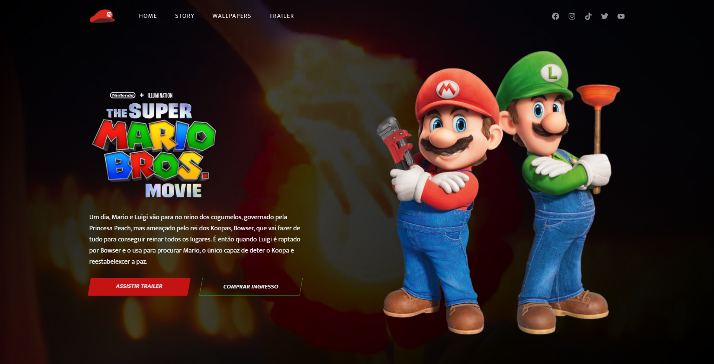
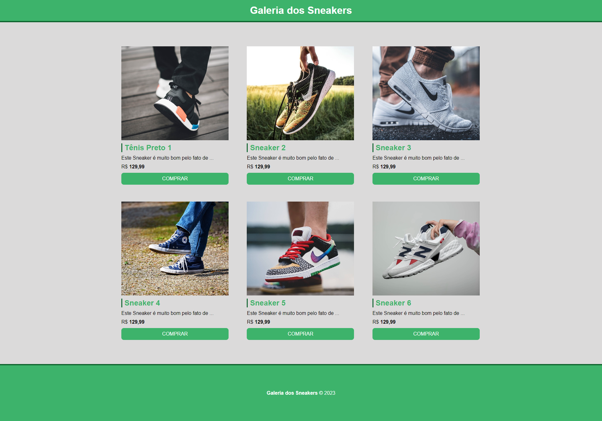

<h1 align="center">
    Meus Projetos
</h1>

<table> 
<thead>
        <tr>
            <th align="center">
                 
                

                    <small>#</small>
                

            </th>  
            <!--  linha 2 ---------------------------------------- -->
            <th align="center">
                 
                
 
                    <small>
                        NAME
                    </small>
                

            </th>
            <th align="left">
                
                
 
                    <small>
                     DATE
                    </small>
                

            </th>
            <th align="center">
                
                
 
                    <small>
                    PREVIEW
                    </small>
                

            </th>
        </tr>
    </thead>
<!-- --------------linha 2----------------------------------------- -->
    <tbody>
        <tr>
            <td>01</td>
            <td><a href="Mario-Bros">Site do filme Mario Bros</a></td>
            <td>19/10/23</td>
            <td align="center">
            </td>
        </tr>
        <tr>
            <td>02</td>
            <td><a href="galeria-sneakers">Galeria Sneakers</a></td>
            <td>16/10/23</td>
            <td align="center"></td>
        </tr>
    </tbody>

</table>